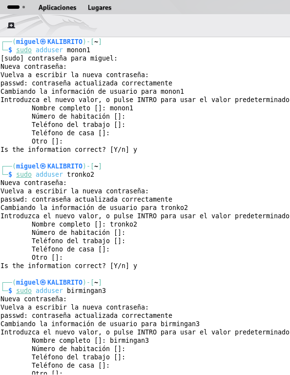
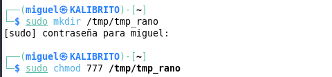

# FASE 1: Gestión de Permisos

## Ejercicio 1: Gestión de Permisos en un Entorno Multiusuario

### Crear los usuarios:

### Crear el grupo y añadir los usuarios:

### Crear el directorio del proyecto y asignar el grupo:

### Aplicar los permisos y verificarlos:

### Cambiar el propietario del directorio a monon1 y ajustar los permisos para el grupo:

- Se quiere que el grupo deveria2 solo pueda leer y ejecutar, pero no escribir.

---

## Respuestas a las preguntas:

### ¿Que sucede si un usuario fuera del grupo deveria2 intenta acceder al directorio? 

- Recibirá un error de "Permiso denegado". La última cifra de los permisos es 0, lo que significa que la categoría "otros" no tiene ningún permiso, ni siquiera para entrar al directorio.

### ¿Qué sucede si tronko2 intenta modificar un archivo dentro del directorio?

- Recibirá un error de "Permiso denegado". tronko2 pertenece al grupo deveria2, y los permisos para el grupo son r-x (lectura y ejecución), pero no w (escritura). Por lo tanto, puede listar el contenido del directorio pero no crear, modificar o eliminar archivos dentro de él.

---

## Ejercicio 2: Control de Acceso con el Bit SGID

### Crear el subdirectorio, asignar el grupo, aplicar el bit SGID y verificar los permisos

### Prueba de creación de archivos:

---

## Respuestas a las preguntas:

### ¿Cuál es el grupo propietario del archivo creado por tronko2?

- El grupo propietario es deveria2, no el grupo primario de tronko2. Esto ocurre gracias al bit SGID en el directorio contenedor.

### ¿Qué ventaja aporta el bit SGID en un entorno de colaboración?

- Asegura que todos los archivos del proyecto compartido mantengan una propiedad de grupo consistente, sin importar qué miembro del equipo los cree. Esto evita problemas de permisos y simplifica la gestión del acceso.

--- 

## Ejercicio 3: Gestión de Archivos Temporales con Sticky Bit

### Crear el directorio, darle permisos abiertos.

### Aplicar el Sticky Bit y verificar permisos.

### Prueba de creación y borrado

---

## Respuestas a las preguntas:

### ¿Pudo birmingan3 eliminar el archivo de monon1? ¿Por qué?

- No. El "sticky bit" en un directorio significa que solo el propietario del archivo (o el propietario del directorio, o root) puede eliminar o renombrar un archivo dentro de él, aunque otros usuarios tengan permisos de escritura en el directorio.

### ¿Cómo ayuda el sticky bit a mejorar la seguridad en directorios compartidos?

- Previene que los usuarios borren o modifiquen accidental o maliciosamente los archivos de otros en un espacio de trabajo común, garantizando la integridad de los datos de cada usuario.

---

## Ejercicio 4: Configuración de umask

### Verificar, cambiar umask y crear un archivo de prueba

### Restaurar el umask

---

## Respuestas a las preguntas:

### ¿Cómo afectó el valor de umask a los permisos de los nuevos archivos?

- umask 077 eliminó todos los permisos para el grupo y para otros en el archivo recién creado, dejándolo con permisos 600 (rw-------). El archivo es completamente privado para su propietario.

### ¿Cómo podrías usar umask para mejorar la seguridad?

- Estableciendo un umask restrictivo (como 077 o 027) por defecto para los usuarios (por ejemplo, en el archivo /etc/profile), se asegura que los archivos creados no sean accidentalmente legibles o modificables por otros.

---

## Ejercicio 5: Implementación de ACLs

### Crear el entorno y aplicar la ACL 

### Verificar la ACL

---

---

# FASE 2: Reto de Búsquedas Avanzadas

## Crear la estructura

## Rellenar el contenido y verificar la creación

---

## Ejercicios con grep (Búsqueda de Contenido)

### Buscar Errores Críticos

### Buscar la Configuración de Producción

### Contar fallos y lineas sin comentarios

## Ejercicios con find (Búsqueda de Archivos por Propiedad)

### Archivos de Configuración y Directorios Específicos

### Archivos Grandes (Simulación)

## Archivos Modificados Recientemente

## Ejercicios con locate (Búsqueda Rápida en Base de Datos)

### Busqueda general

### Busqueda sin destincion

