# Índice
- [Herramientas de Análisis de Red y Monitorización (SIEM)](#Herramientas-de-Análisis-de-Red-y-Monitorización-SIEM)
  - [1. WHOIS Lookup](#1-WHOIS-Lookup)
    - [¿Para qué sirve?](#¿Para-qué-sirve)
    - [🧪 Prueba de Uso](#🧪-Prueba-de-Uso)
  - [2. Urlscan.io](#2-Urlscanio)
    - [¿Para qué sirve?](#¿Para-qué-sirve)
    - [🧪 Prueba de Uso](#🧪-Prueba-de-Uso)
  - [3. LogRhythm (SIEM)](#3-LogRhythm-SIEM)
    - [Funciones Principales](#Funciones-Principales)
    - [🛡️ Caso de Uso: Detección de Ataque de Fuerza Bruta](#🛡️-Caso-de-Uso-Detección-de-Ataque-de-Fuerza-Bruta)
  - [Resumen de Herramientas](#Resumen-de-Herramientas)
- [Análisis de Amenazas y Vulnerabilidades](#Análisis-de-Amenazas-y-Vulnerabilidades)
  - [1. VirusTotal (Inteligencia de Amenazas)](#1-VirusTotal-Inteligencia-de-Amenazas)
    - [🧪 Prueba de Concepto (PoC)](#🧪-Prueba-de-Concepto-PoC)
  - [2. Dehashed (Fugas de Información)](#2-Dehashed-Fugas-de-Información)
    - [🧪 Prueba de Concepto](#🧪-Prueba-de-Concepto)
  - [3. OpenVAS / GVM (Escaneo de Vulnerabilidades)](#3-OpenVAS--GVM-Escaneo-de-Vulnerabilidades)
    - [⚙️ Instalación y Configuración](#⚙️-Instalación-y-Configuración)
    - [📊 Resultados del Escaneo (Target: "tutoz")](#📊-Resultados-del-Escaneo-Target-tutoz)
- [Ingeniería Social y Forense](#Ingeniería-Social-y-Forense)
    - [👤 Ingeniería Social y Forense (Dorian)](#👤-Ingeniería-Social-y-Forense-Dorian)
    - [Social Engineering Toolkit \- SET (Ataques Humanos)](#Social-Engineering-Toolkit---SET-Ataques-Humanos)
    - [Phonebook (Reconocimiento de Correos)](#Phonebook-Reconocimiento-de-Correos)
    - [RegRipper (Análisis Forense)](#RegRipper-Análisis-Forense)
- [Informe de Auditoría OSINT](#Informe-de-Auditoría-OSINT)
  - [1. Verificación de Identidad (Namecheck)](#1-Verificación-de-Identidad-Namecheck)
  - [2. Inteligencia de Imágenes (TinEye)](#2-Inteligencia-de-Imágenes-TinEye)
    - [🖼️ Imagen de Referencia](#🖼️-Imagen-de-Referencia)
    - [🔍 Resultados del Análisis](#🔍-Resultados-del-Análisis)
  - [3. Análisis de Infraestructura (ViewDNS.info)](#3-Análisis-de-Infraestructura-ViewDNSinfo)
    - [3.1 Información de Registro (WHOIS)](#31-Información-de-Registro-WHOIS)
    - [3.2 Historial de Direcciones IP](#32-Historial-de-Direcciones-IP)
    - [3.3 Búsqueda Inversa de IP (Reverse IP)](#33-Búsqueda-Inversa-de-IP-Reverse-IP)
    - [3.4 Escaneo de Puertos](#34-Escaneo-de-Puertos)
    - [3.5 Panel de Herramientas Disponibles](#35-Panel-de-Herramientas-Disponibles)
---
# Herramientas de Análisis de Red y Monitorización (SIEM)

**Autor:** Santiago Heredia


---

## 1. WHOIS Lookup

El protocolo **WHOIS** se utiliza para consultar bases de datos que almacenan los usuarios registrados o asignatarios de un recurso de Internet, como un nombre de dominio o una dirección IP.

### ¿Para qué sirve?
* **Identificación:** Permite conocer al propietario de una dirección IP (ISP, empresa, país).
* **Contacto Técnico:** Facilita encontrar información de contacto en caso de abusos o ataques.
* **Geolocalización:** Ayuda a determinar el origen aproximado de una conexión.

### 🧪 Prueba de Uso

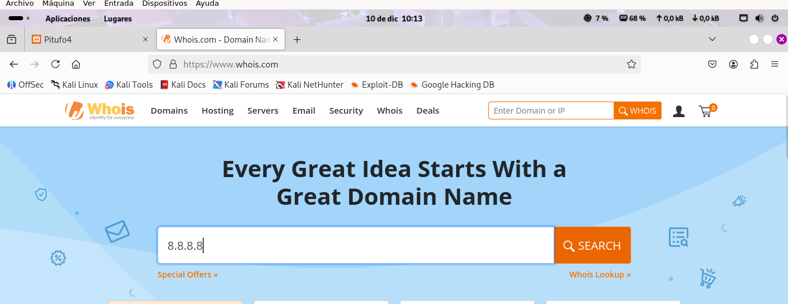
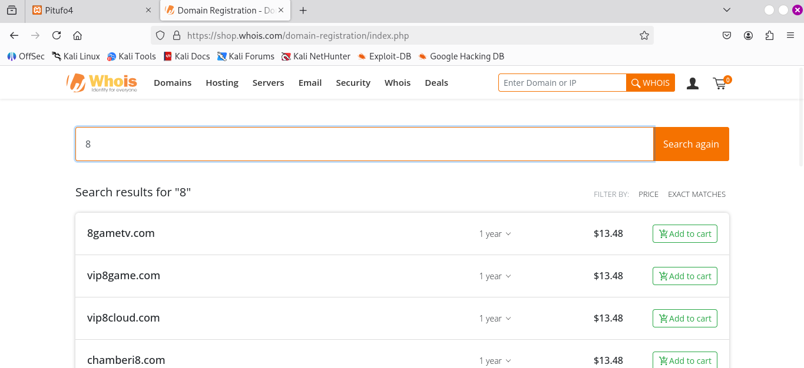

---

## 2. Urlscan.io

**Urlscan.io** es un servicio de "sandbox" que analiza sitios web de forma segura. Actúa como un usuario real navegando a la página y registra toda la actividad generada.

### ¿Para qué sirve?
* **Análisis Seguro:** Permite verificar si un enlace es malicioso sin abrirlo en tu computadora.
* **Inspección Técnica:** Muestra qué scripts (JavaScript) carga una página y a qué dominios externos se conecta.
* **Detección de Phishing:** Ofrece capturas de pantalla del sitio para verificar su legitimidad visualmente.

### 🧪 Prueba de Uso

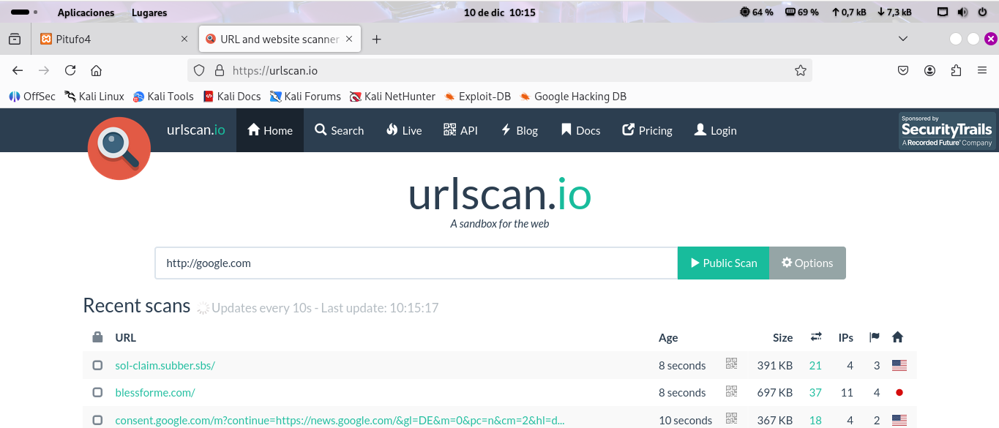
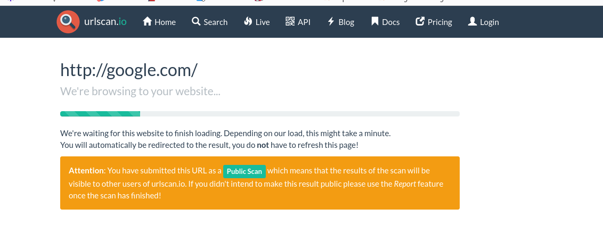
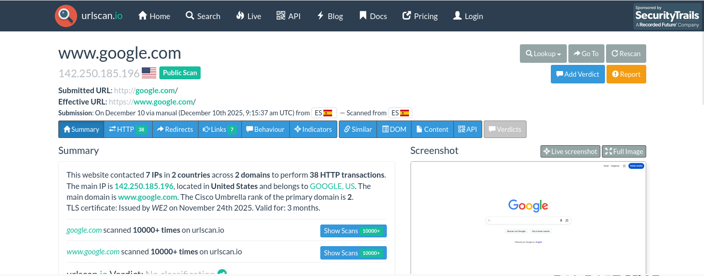

---

## 3. LogRhythm (SIEM)

**LogRhythm** es una marca líder en ciberseguridad, especializada en soluciones **SIEM (Security Information and Event Management)**. Actualmente integrada en la cartera de **Exabeam**, su producto principal, **LogRhythm SIEM**, es comúnmente autohospedado (*self-hosted*).

### Funciones Principales

La herramienta proporciona visibilidad completa de la seguridad de una organización mediante tres pilares:

1.  **Recolección de Logs (Log Management):**
    * Recopila, normaliza y almacena eventos de firewalls, servidores, aplicaciones, endpoints y dispositivos de red.
2.  **Detección de Amenazas:**
    * Analiza datos en tiempo real buscando patrones anómalos mediante UEBA (Análisis de Comportamiento de Usuarios y Entidades) e IA.
3.  **Cumplimiento Normativo (Compliance):**
    * Facilita el cumplimiento de normas como **HIPAA**, **GDPR** y **PCI-DSS** al generar informes y almacenar logs de manera segura.

> LogRhythm transforma millones de registros diarios en información accionable para los equipos SOC (Centro de Operaciones de Seguridad).

### 🛡️ Caso de Uso: Detección de Ataque de Fuerza Bruta

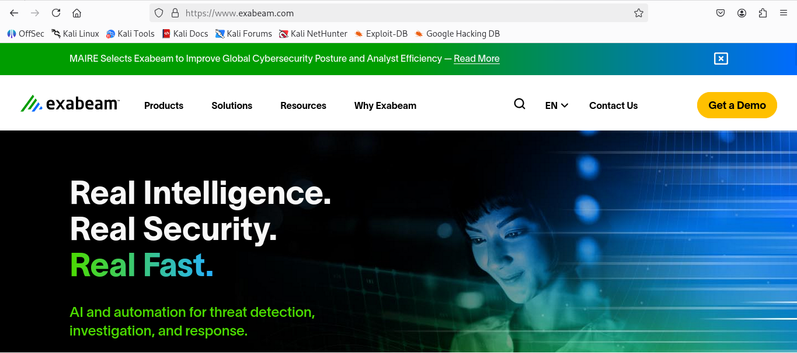

**Flujo del Proceso de Defensa:**

| Paso | Descripción de la Actividad | Función de LogRhythm SIEM |
| :--- | :--- | :--- |
| **1. Ingesta de Datos** | Un atacante realiza miles de intentos de inicio de sesión. | El SIEM ingiere y normaliza eventos de inicio de sesión fallido y la IP de origen. |
| **2. Aplicación de Reglas** | Se superan umbrales definidos (ej: 25 fallos en 60 s). | El motor de correlación detecta la actividad anómala basándose en la regla configurada. |
| **3. Alerta y Priorización** | La regla se activa. | Se genera una alerta de **alta severidad** con puntaje de riesgo y línea de tiempo del incidente. |
| **4. Respuesta (SOAR)** | Se desea bloquear la IP atacante. | El módulo SOAR envía automáticamente una orden al firewall para bloquear la IP. |
| **5. Investigación** | El analista revisa la alerta. | Se confirma el ataque y se documenta el incidente para futuras auditorías. |

---

## Resumen de Herramientas

| Herramienta | Tipo | Uso principal | Nivel de Riesgo (Uso) |
| :--- | :--- | :--- | :---: |
| **WHOIS** | OSINT / Redes | Identificar dueños de IP y Dominios | Bajo |
| **Urlscan.io** | Defensa / Análisis | Escaneo seguro de URLs sospechosas | Bajo |
| **LogRhythm** | Defensa / Gestión | Visibilidad centralizada y respuesta (SIEM) | Bajo |

---

# Análisis de Amenazas y Vulnerabilidades

**Autor:** Miguel Enrique
---

## 1. VirusTotal (Inteligencia de Amenazas)

**VirusTotal** es la base de datos de malware más famosa del mundo, propiedad de Google. Funciona como un agregador que analiza cualquier archivo o enlace utilizando más de 70 motores antivirus diferentes simultáneamente.

* **Función principal:** Obtener una "segunda opinión" masiva y rápida sobre si un archivo adjunto o una URL es maliciosa, basándose en la reputación global y firmas conocidas.

### 🧪 Prueba de Concepto (PoC)

1.  **Creación del "Virus":**
    * Se crea un archivo de texto inofensivo utilizando la cadena **EICAR**. Este archivo está diseñado por desarrolladores de antivirus para ser detectado como amenaza durante pruebas, sin causar daño real.
  
    

2.  **Generación del Hash:**
    * No subimos el archivo inmediatamente; generamos su *hash* (firma digital) para verificarlo primero.

    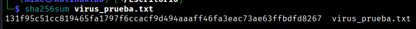

3.  **Verificación:**
    * Pegamos la cadena o el hash en VirusTotal.
    * **Resultado:** Decenas de motores antivirus detectan el archivo como malicioso automáticamente.

    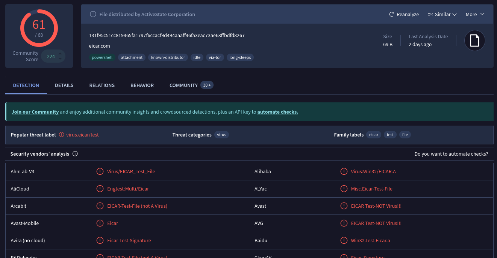

---

## 2. Dehashed (Fugas de Información)

**Dehashed** es un motor de búsqueda especializado en bases de datos filtradas y credenciales comprometidas. Permite investigar si un correo electrónico, usuario, IP o teléfono ha aparecido en brechas de seguridad públicas (*leaks*).

* **Función principal:**
    * **Atacantes:** Buscan contraseñas reutilizadas.
    * **Defensores:** Alertan a los usuarios para cambiar claves.
* **Reconocimiento Pasivo:** Si nuestros correos aparecen aquí, un atacante sabrá que nuestras credenciales podrían estar en la Dark Web.

### 🧪 Prueba de Concepto

1.  **Acceso:** Entramos en [Dehashed.com](https://www.dehashed.com/).
2.  **Búsqueda:** Pegamos el correo electrónico de prueba.
3.  **Resultado:**
    * Aparecen múltiples filtraciones asociadas al correo.
    * **Acción requerida:** Esto nos obliga a implementar **2FA (Doble Factor de Autenticación)** inmediatamente para mitigar el riesgo.

    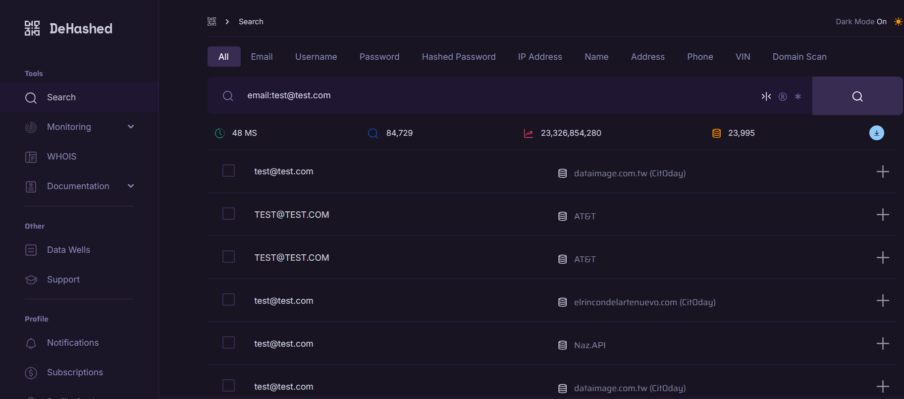

---

## 3. OpenVAS / GVM (Escaneo de Vulnerabilidades)

**OpenVAS (Greenbone Vulnerability Management)** es un escáner de vulnerabilidades de código abierto que actúa como un "auditor automatizado". Examina la red buscando software desactualizado, malas configuraciones y fallos de seguridad.

* **Función principal:** Generar informes de riesgo y detectar "puertas abiertas" antes de que sean explotadas.

### ⚙️ Instalación y Configuración

Se ejecutaron los siguientes comandos en la terminal para preparar el entorno:

1.  **Instalación y configuración inicial:**
    ```bash
    sudo apt install gvm -y && sudo gvm-setup
    ```
2.  **Arranque del servicio:**
    ```bash
    sudo gvm-start
    ```
3.  **Acceso administrativo:**
    Fue necesario cambiar la contraseña del usuario `admin` para acceder a la interfaz web:
    ```bash
    sudo -u _gvm gvmd --user=admin --new-password=admin
    ```

    

### 📊 Resultados del Escaneo (Target: "tutoz")

Tras 40 minutos de escaneo, el reporte mostró mayoritariamente registros informativos, pero destacó dos riesgos de nivel **Medio (Medium)**:

| Vulnerabilidad | Puntuación | Descripción del Riesgo |
| :--- | :---: | :--- |
| **SSL/TLS: Report Weak Cipher Suites** | **5.9** | La encriptación de la página web es débil y podría ser descifrada por un atacante. |
| **FTP Unencrypted Cleartext Login** | **4.8** | El servicio FTP permite entrar sin encriptación. Si alguien intercepta la red, puede ver usuario y contraseña en texto plano. |

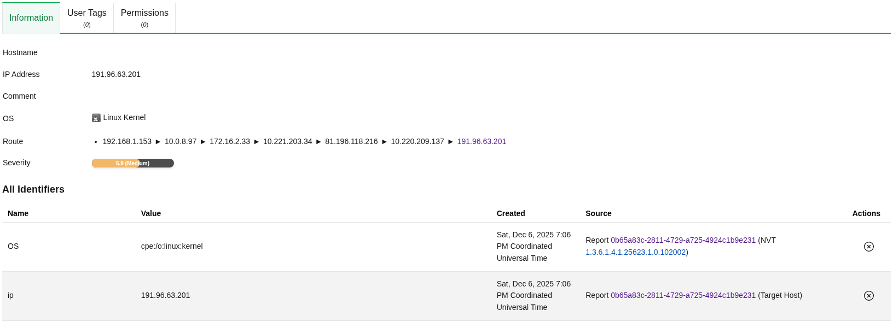
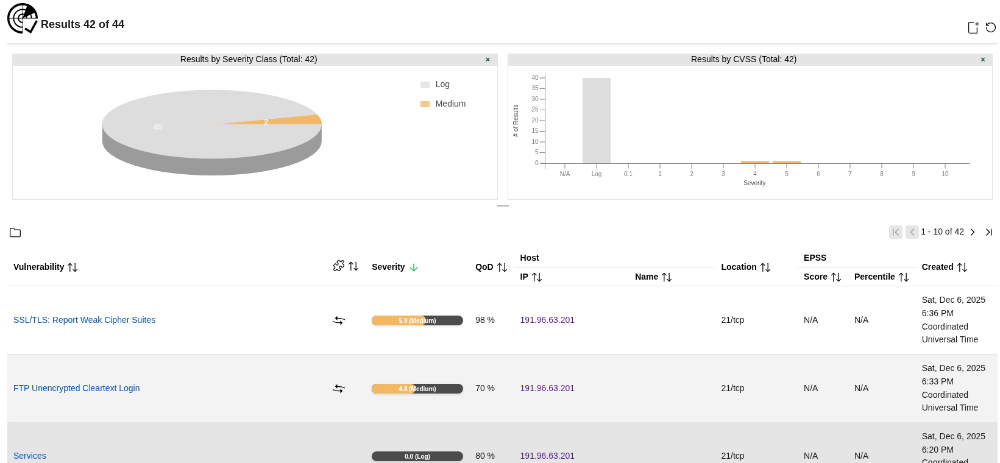

---
# Ingeniería Social y Forense
**Autor:** Dorian


---

### **👤 Ingeniería Social y Forense (Dorian)**

### **Social Engineering Toolkit \- SET (Ataques Humanos)**
> Es un marco de trabajo (framework) diseñado para realizar pruebas de ataque contra el eslabón más débil: el ser humano. Sirve para automatizar la creación de correos de phishing, clonar páginas web de login para robar contraseñas o crear dispositivos USB infectados. Los auditores lo usan para simular campañas reales y evaluar si los empleados de una empresa caerían en una trampa.

#### **\-. Instalación y Prueba:**

##### 1.- Instalación de la herramienta según el github

```
git clone https://github.com/trustedsec/social-engineer-toolkit/ setoolkit/
cd setoolkit
pip3 install -r requirements.txt
python setup.py
```

##### 2.- ejecución de SET

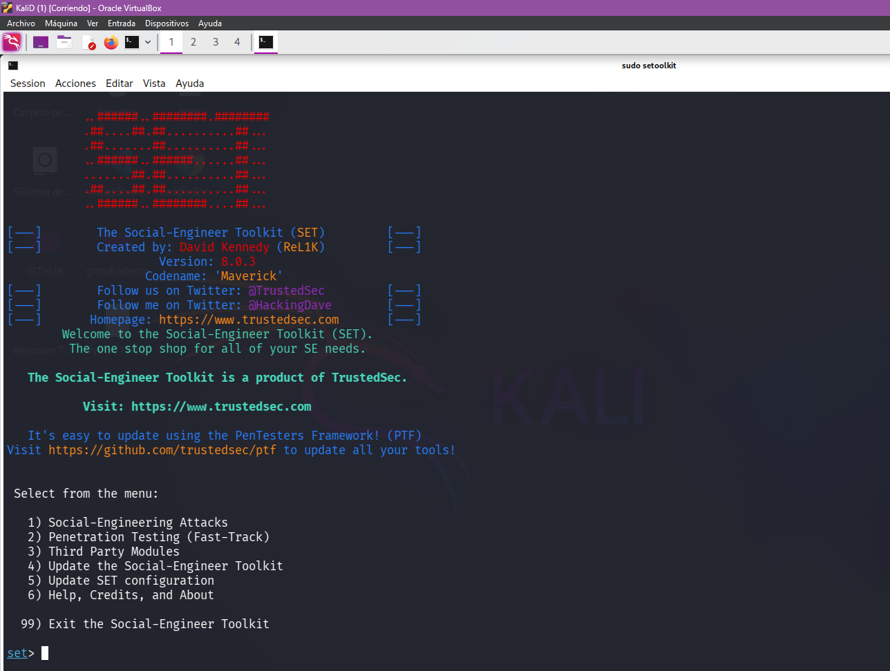

>**Menú Principal \>\>\> opción 1**(Social-Engineering Attacks)
>
>Seleccioné esta categoría para enfocar la auditoría en el "factor humano" y no en fallos de software.

>**Vector de Ataque \>\>\> opción** **2** (Website Attack Vectors).
>
>Elegí este vector para utilizar una página web maliciosa como medio para el ataque.

> **Método \>\>\>** **opción** **3** (Credential Harvester Attack Method).
>
>Activé este método con el fin de interceptar y capturar las credenciales (usuario y contraseña) enviadas por la víctima.

>**Técnica \>\>\> opción** **2** (Site Cloner)
>
>Utilicé esta técnica para clonar idénticamente la interfaz del sitio real y hacer el engaño indetectable visualmente.

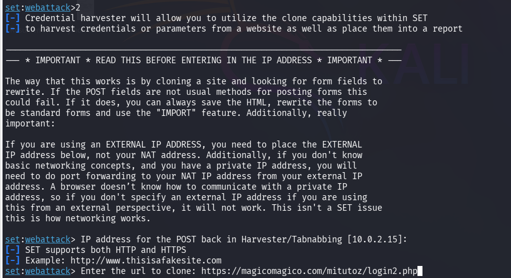

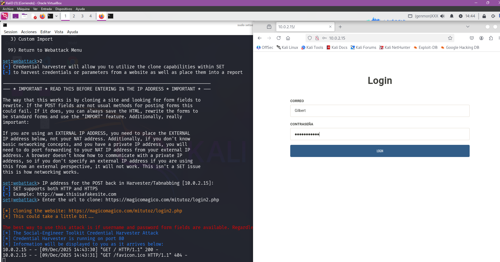

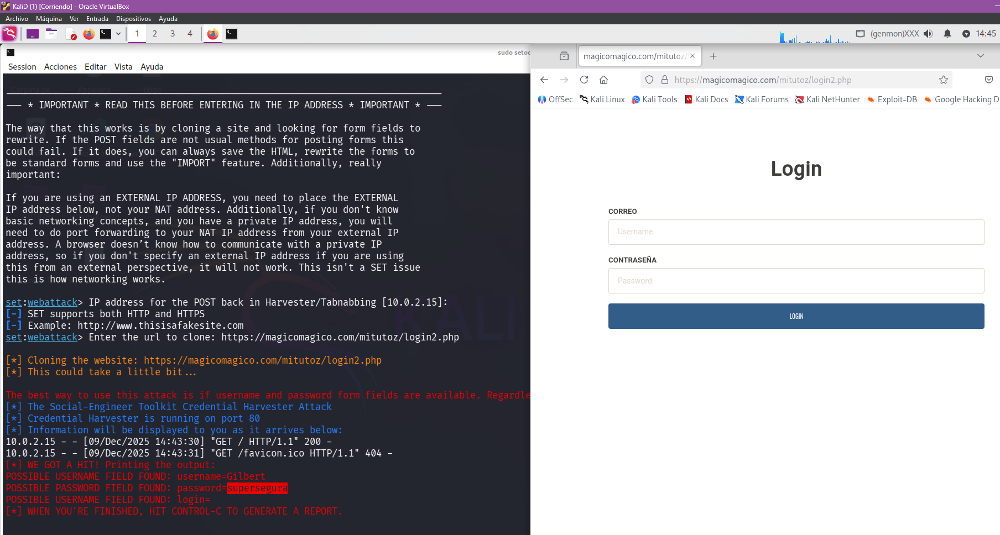

##### Otras funciones de la herramienta SET:

>**Infectious Media Generator (USB):** Crea dispositivos USB con archivos trampa (*autorun/payloads*) para ataques físicos. Evalúa el riesgo de que los empleados conecten hardware desconocido a la red corporativa.

>**Mass Mailer Attack (Email):** Automatiza el envío masivo de correos falsificados (*spoofing*) a los objetivos. Funciona como el "camión de reparto" para distribuir el enlace de tu página de *phishing*.

>**PowerShell Attack Vectors (Control):** Genera *scripts* avanzados para obtener control remoto total del sistema (Shell). Demuestra el impacto crítico de lograr ejecución de código en una máquina Windows.

>**QRCode Generator (Móvil):** Convierte la URL maliciosa en un código QR para atacar dispositivos móviles. Explota la confianza del usuario al escanear códigos físicos con su teléfono.

### **Phonebook (Reconocimiento de Correos)** 

>Es una herramienta de reconocimiento muy específica que lista todos los dominios, direcciones de correo electrónico y URLs asociados a un objetivo concreto. Sirve para mapear rápidamente la superficie de exposición de una organización, permitiendo a un investigador encontrar patrones de correos (ej: *nombre.apellido@empresa.com*) que luego podrían ser usados en pruebas de acceso o campañas de concienciación.

#### .-Prueba:

 Durante la fase de pruebas, la herramienta *Phonebook.cz* solicitó autenticación de pago obligatoria debido a restricciones del servicio.

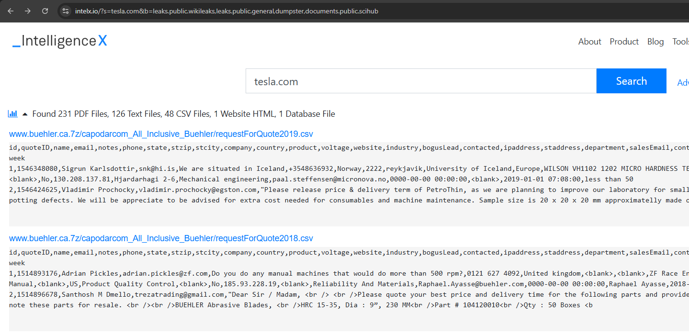

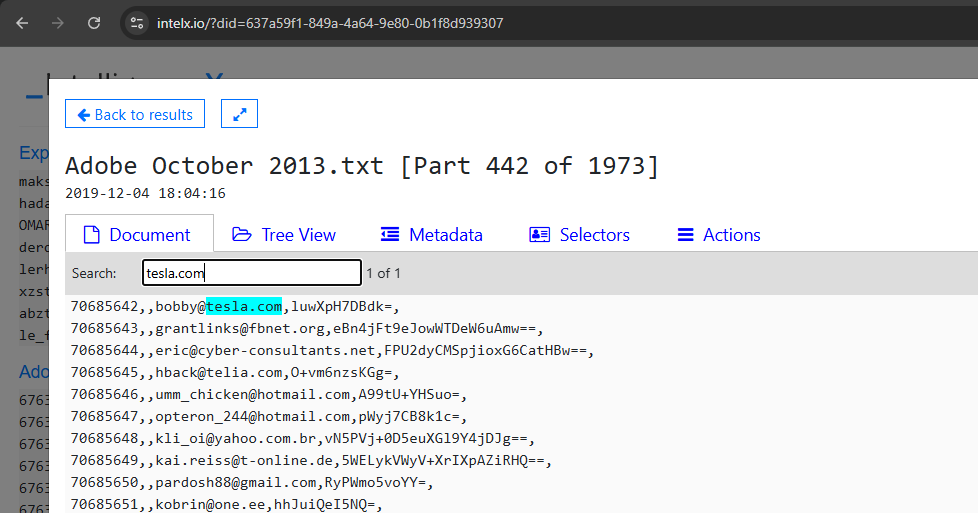

**Hallazgo (Intelligence X):** Encontré al usuario bobby@tesla.com dentro de la filtración pública de *Adobe (2013)*, que expuso tanto su correo como el hash de su contraseña.

**Análisis de Riesgo:** Esto confirma el uso inseguro de cuentas corporativas en servicios externos. Representa un riesgo crítico de **Credential Stuffing**, ya que se podría usar esa contraseña antigua para intentar acceder a la red actual de la empresa si el usuario sigue con la misma contraseña.

### **RegRipper (Análisis Forense)**

> Esta herramienta es crucial para la informática forense (Blue Team) y se utiliza para extraer y analizar datos del Registro de Windows. Sirve para "leer la historia" de lo que ha ocurrido en un ordenador: permite ver qué dispositivos USB se conectaron, qué programas se ejecutaron recientemente o qué archivos se abrieron, incluso si el usuario intentó borrarlos. Es indispensable para investigar incidentes post-mortem.

#### \-. Prueba 

> - Primero para hacer el análisis forense extraje los datos de un cliente windows en el que abrí la calculadora y el notepad para luego verlo en el análisis forense

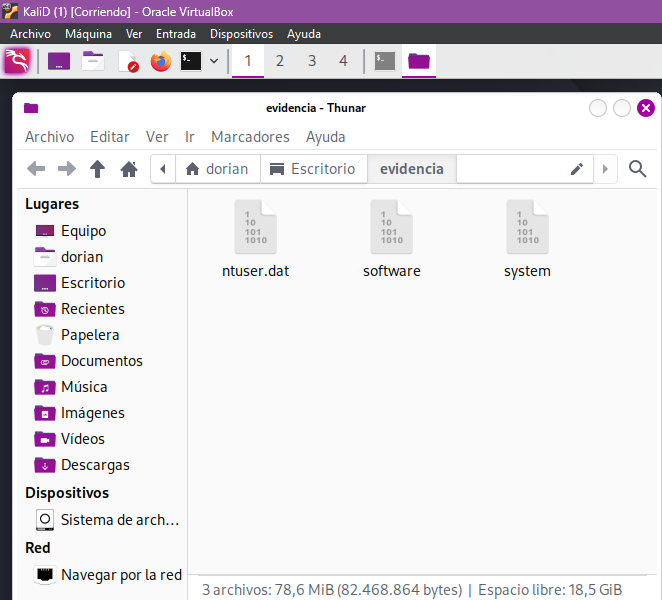

> - Luego en Kali realicé el análisis forense con la herramienta  
  
1-. Listar los usb que estaban conectados a la maquina:

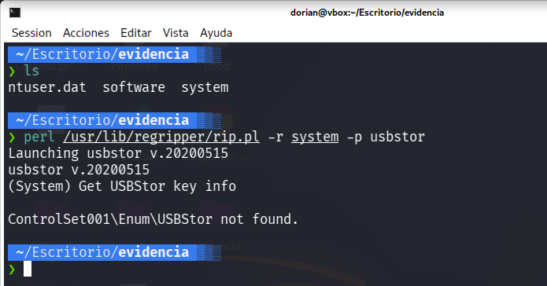

2-. Listar los programas que ejecutó el usuario:

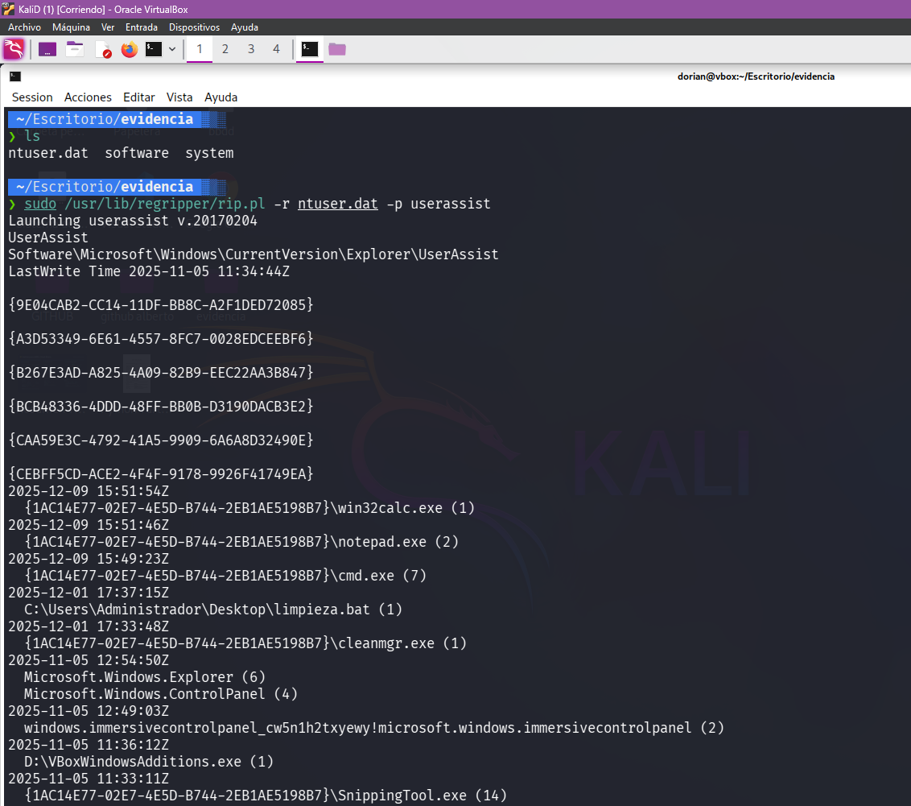

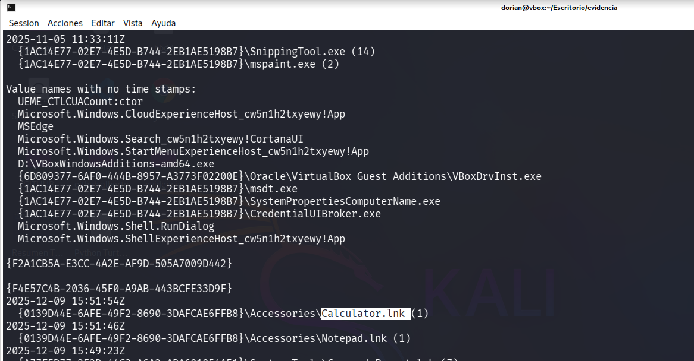

3-. También se puede generar un reporte completo:

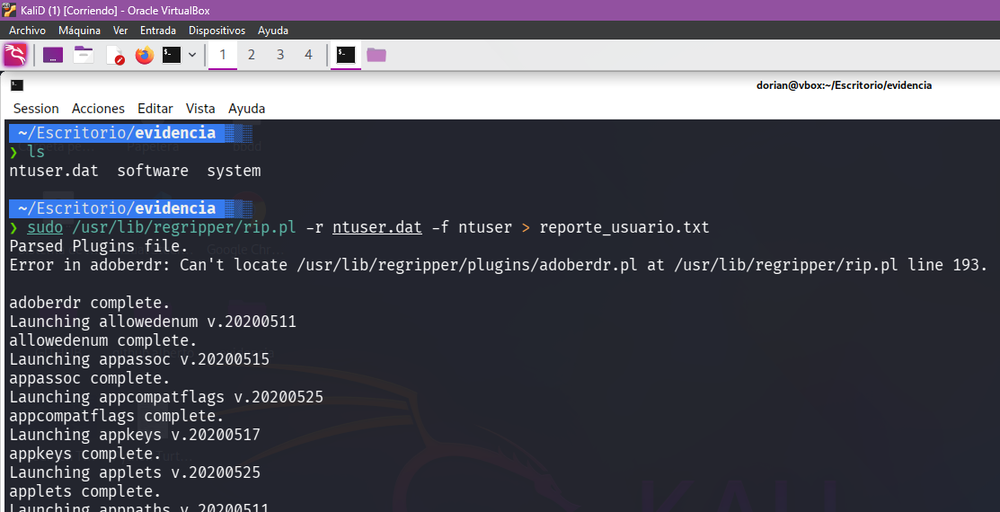

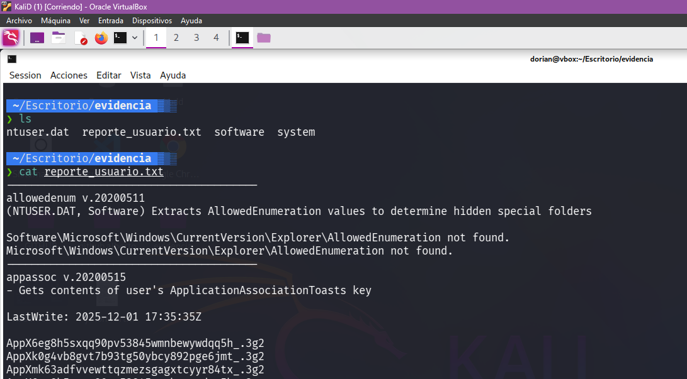
---
# Informe de Auditoría OSINT

**Autor:** Gonzalo Lopez

1.  **Namecheck** (Verificación de huella digital y usuarios).
2.  **TinEye** (Inteligencia inversa de imágenes).
3.  **ViewDNS** (Análisis profundo de infraestructura de red).

---

## 1. Verificación de Identidad (Namecheck)

En esta sección se analiza la disponibilidad de nombres de usuario en múltiples plataformas sociales para identificar la huella digital del objetivo y detectar redes activas.

> **Nota:** Espacio reservado para las capturas de Namecheck.

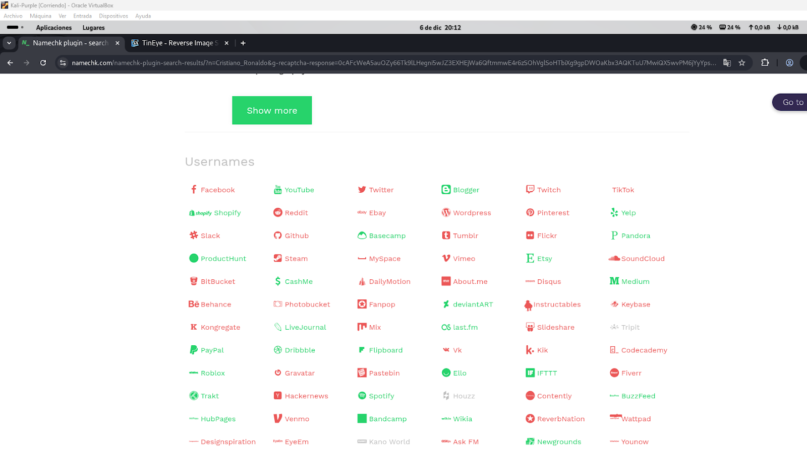
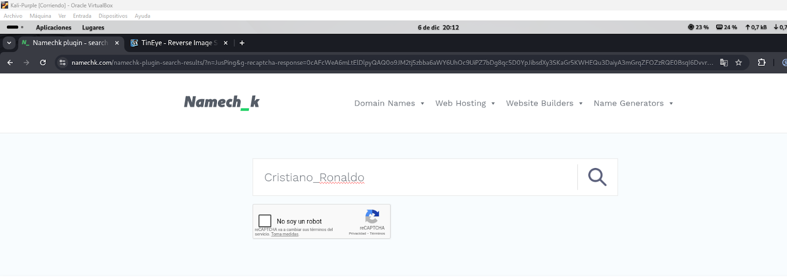

---

## 2. Inteligencia de Imágenes (TinEye)

Se utilizó la herramienta **TinEye** para realizar una búsqueda inversa de una imagen específica, con el fin de rastrear su origen, fecha de aparición y propagación en la web.

### 🖼️ Imagen de Referencia
Fotografía del sujeto (Cristiano Ronaldo en etapa Manchester United) utilizada como semilla para la búsqueda.


### 🔍 Resultados del Análisis
La herramienta localizó **487 resultados** indexados en la web.

* **Dato Clave (Cronología):** La imagen fue rastreada por primera vez el **22 de julio de 2008**.
* **Conclusión:** Este dato permite fechar la antigüedad del recurso y ayuda a desmentir usos recientes falsos o fuera de contexto (Fake News).

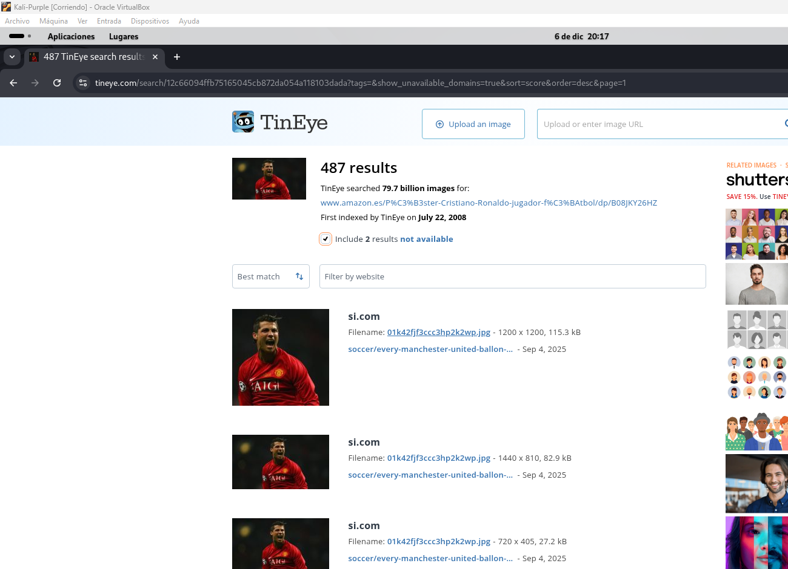

---

## 3. Análisis de Infraestructura (ViewDNS.info)

Se realizó un reconocimiento profundo sobre el dominio objetivo: **`tesla.com`**.
El objetivo fue entender su configuración de red, postura de seguridad y propiedad.

### 3.1 Información de Registro (WHOIS)
Consulta de los datos administrativos del dominio.

* **Registrador:** MarkMonitor.
* **Antigüedad:** Dominio creado en **1992**.

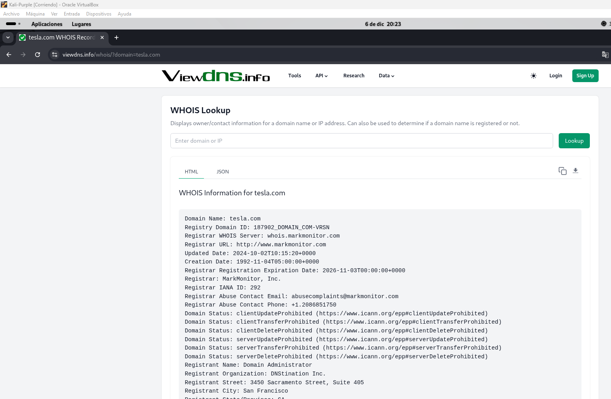

### 3.2 Historial de Direcciones IP
Se analizó el historial de alojamientos del dominio.

* **Hallazgo:** Se observa un uso extensivo de IPs pertenecientes a **Akamai**.
* **Ubicaciones:** Alemania, Brasil, Australia, EE. UU.
* **Interpretación:** Esto confirma el uso de una **CDN (Red de Distribución de Contenido)** global para mejorar la velocidad y seguridad.

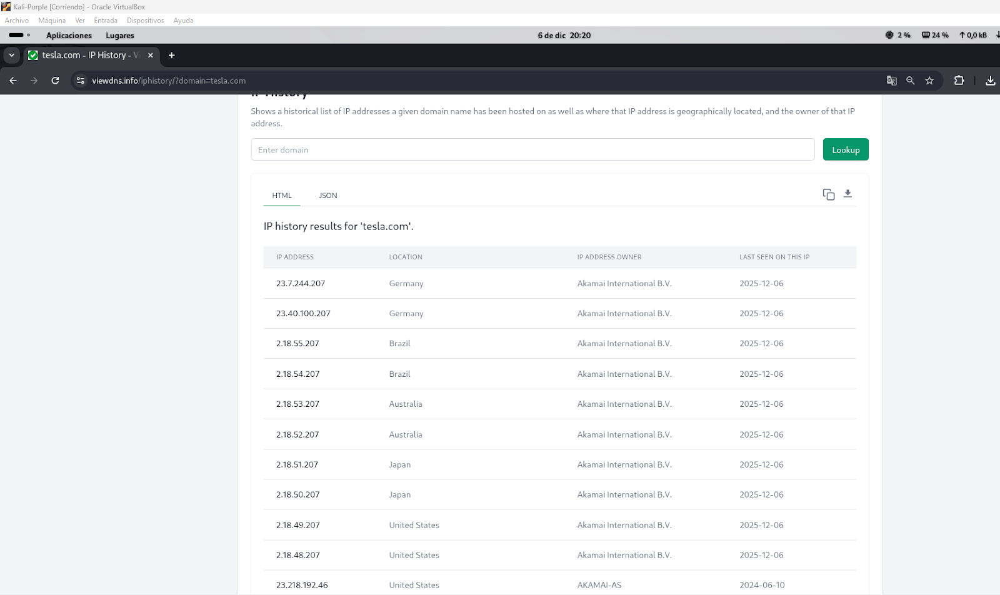

### 3.3 Búsqueda Inversa de IP (Reverse IP)
Verificación de vecindad (otros dominios alojados en la misma IP).

* **Resultado:** El servidor parece estar dedicado o configurado para servir exclusivamente a `tesla.com` en esa IP de entrada, sin compartir alojamiento con sitios ruidosos o maliciosos.

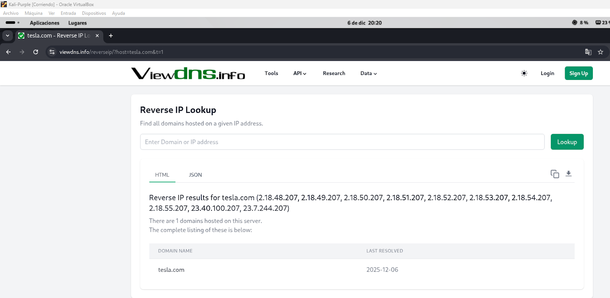

### 3.4 Escaneo de Puertos
Auditoría de puertos abiertos en el servidor objetivo para evaluar la superficie de ataque.

| Puerto | Protocolo | Estado | Interpretación |
| :---: | :---: | :--- | :--- |
| **80** | HTTP | **Open** | Servidor web accesible (normal). |
| **Otros** | Varios | **Filtered** | Buena configuración de Firewall; los puertos no esenciales están ocultos. |

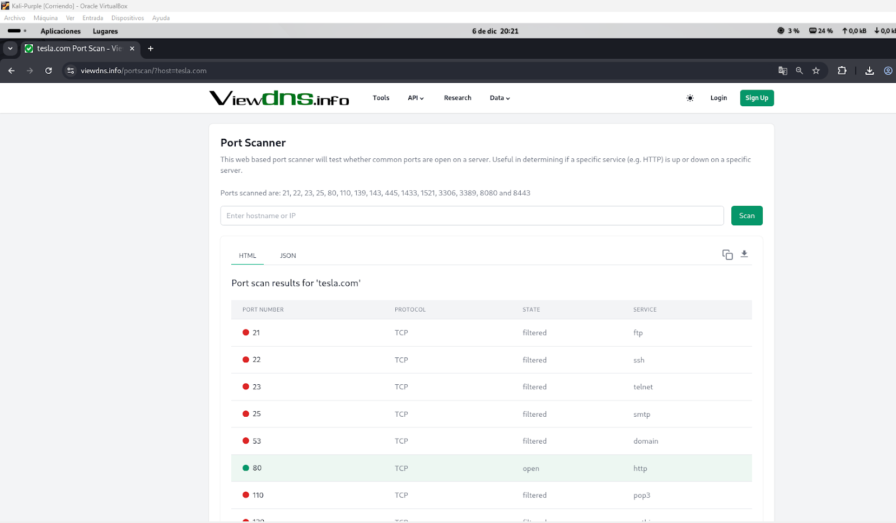

### 3.5 Panel de Herramientas Disponibles
Vista general de las utilidades adicionales ofrecidas por ViewDNS para diagnósticos (Ping, Traceroute, DNS report, etc.).

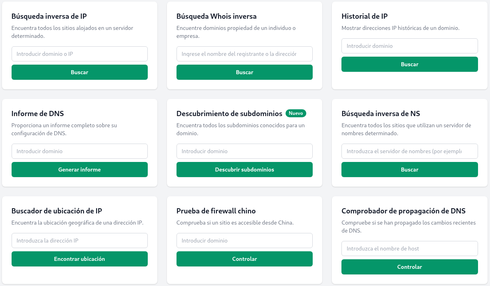
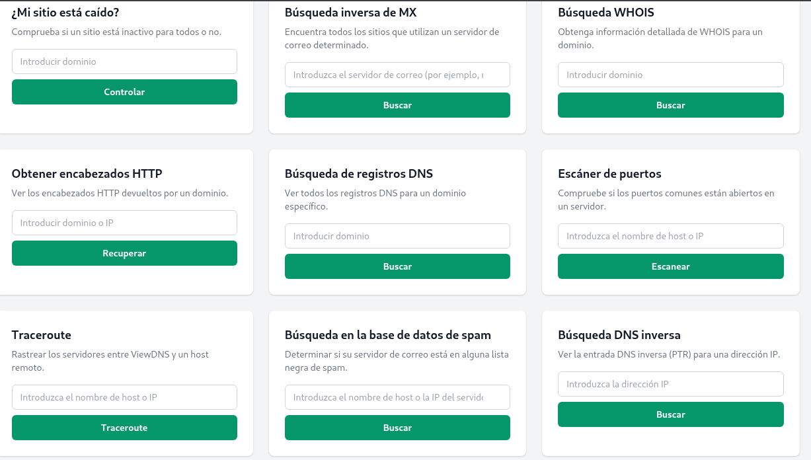

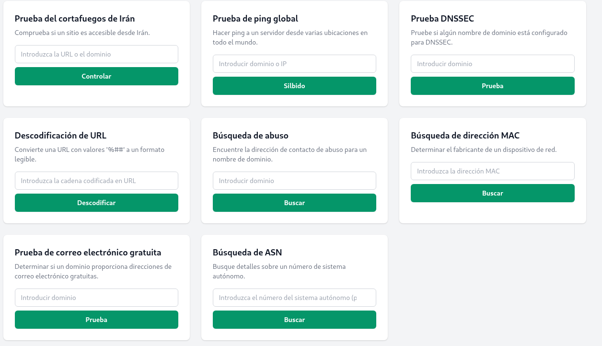
---